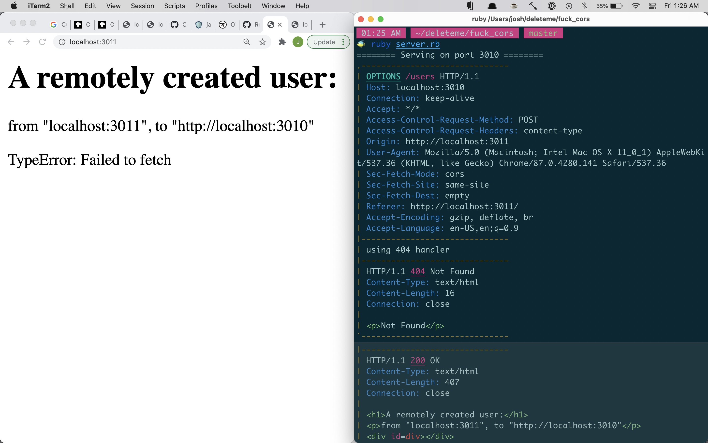

Figuring out the CORS.
=====================

To cheat and see the solution instead of figuring it out yourself like god intended,
check out the branch "solution".

How to run it
-------------

In one terminal:

```sh
ruby server.rb
```

In another terminal:

```sh
ruby client.rb
```

Then navigate one browser to localhost:3011
And another to localhost:3010

You should see the requests that the browser is making to the server,
and how the server is responding incorrectly (404).



Then check out https://developer.mozilla.org/en-US/docs/Web/HTTP/CORS
and figure out what the responses should be (I recommend keeping
`Access-Control-Max-Age` set pretty small (I set it to 5), otherwise
browser caching will prevent it from continuing to make requests, which
will make it really hard to keep trying new things out :P

The timeouts are because the browser keeps trying to hold a connection open,
but the server is about as unsophisticated as is possible to be,
it doesn't have threads or anything, so that causes it to lock up
and not stop serving requests while it's waiting on the browser to
make a request that may never come.
